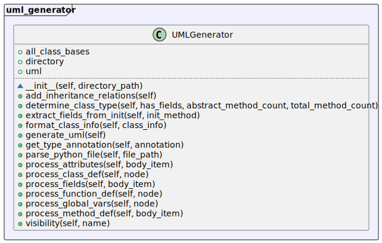

# UML Generator

UML Generator is a Python tool that generates UML diagrams from Python source code. It parses the source code to extract classes, methods, attributes, and their relationships, and then generates a PlantUML representation.

## Features

- Parses Python files to extract classes, methods, attributes, and global variables.
- Generates UML diagrams using PlantUML syntax.
- Supports inheritance relationships between classes.
- Handles visibility of class members (public, protected, private).

## Quick Start
Run the script, specifying the directory with the python code and the file where the result will be saved (UML diagram)
```bash
python3 main.py ./my_python_project ./output/uml_output.puml
```

## Class Diagram
