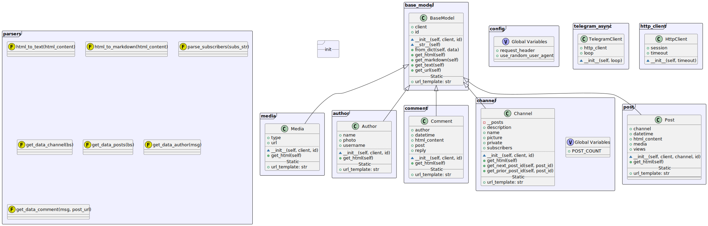

# Telegram Kit

This is an asynchronous client for interacting with Telegram channels and posts. The client fetches and parses HTML content to provide structured data about channels, posts, comments, authors, and media.

## Features
* **Async support**: Utilizes aiohttp for non-blocking HTTP requests.
* **HTML Parsing**: Converts HTML content to structured data using BeautifulSoup.
* **Model Abstraction**: Provides models for Channels, Posts, Comments, Authors, and Media.


## Installation
```bash
git clone https://github.com/yourusername/telegram-async-client.git
cd telegram-async-client
pip install -r requirements.txt
```

## Quick Start
Follow these steps to quickly get started with the Telegram Kit.


### Initialize the Client and Fetch Channel Data
To start using the client, initialize it and fetch basic information about a Telegram channel:
```python
import asyncio
from telegram_async import TelegramClient

async def main():
    async with TelegramClient() as client:
        channel = await client.get_channel('channel_name')
        if channel:
            print(f"Channel Name: {channel.name}")
            print(f"Subscribers: {channel.subscribers}")

asyncio.run(main())
```

## Usage
In continuation of the Quick Start, here are additional functionalities provided by the Telegram Kit library to interact with channels, posts, and comments.


### Load Posts
To load and display posts from a channel, you can extend the previous code as follows:

```python
async def load_posts(channel_name):
    async with TelegramClient() as client:
        channel = await client.get_channel(channel_name)
        if channel:
            posts = await client.load_posts(channel)
            for post_id, post in posts.items():
                print(f"Post ID: {post_id}, Content: {post.html_content}")

asyncio.run(load_posts('channel_name'))
```

### Fetch a Single Post
To fetch a specific post by its ID:

```python
async def fetch_post(channel_name, post_id):
    async with TelegramClient() as client:
        post = await client.get_post(channel_name, post_id)
        if post:
            print(f"Post ID: {post.id}, Content: {post.html_content}")

asyncio.run(fetch_post('channel_name', 12345))
```

### Get Comments for a Post
To retrieve comments for a specific post:

```python
async def fetch_comments(channel_name, post_id):
    async with TelegramClient() as client:
        post = await client.get_post(channel_name, post_id)
        if post:
            comments = await post.get_comments(limit=5)
            for comment in comments:
                print(f"Comment ID: {comment.id}, Content: {comment.html_content}")

asyncio.run(fetch_comments('channel_name', 12345))
```

### Fetch Media
To fetch and display media associated with posts:

```python
async def fetch_media(channel_name):
    async with TelegramClient() as client:
        channel = await client.get_channel(channel_name)
        if channel:
            posts = await client.load_posts(channel)
            for post_id, post in posts.items():
                for media in post.media:
                    print(f"Media URL: {media.url}, Type: {media.type}")

asyncio.run(fetch_media('channel_name'))

```

These examples demonstrate how to extend the basic setup to perform more complex operations with the Telegram Async Client library.

## Class Diagram
